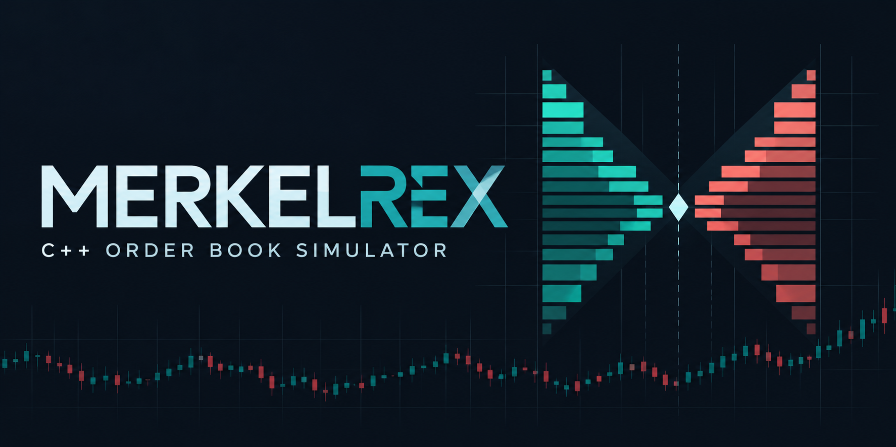
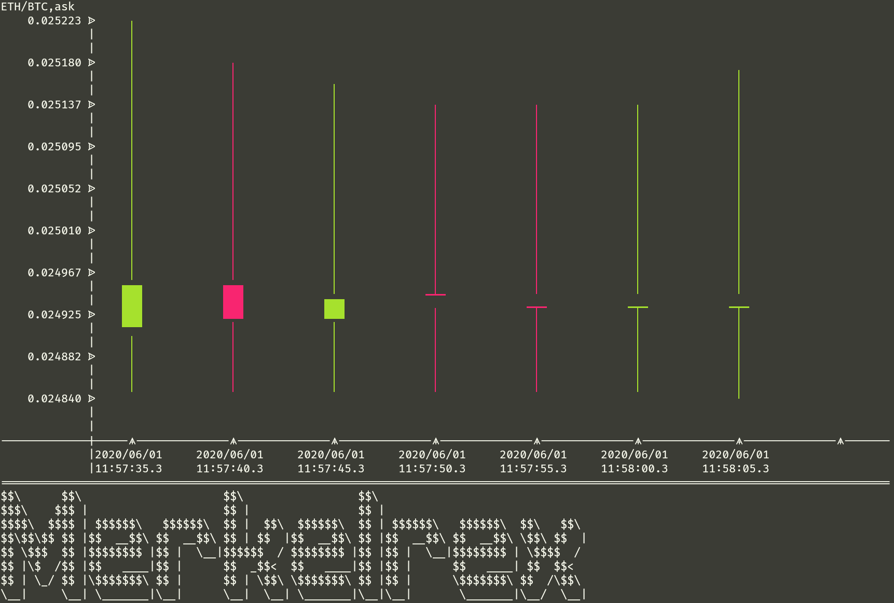
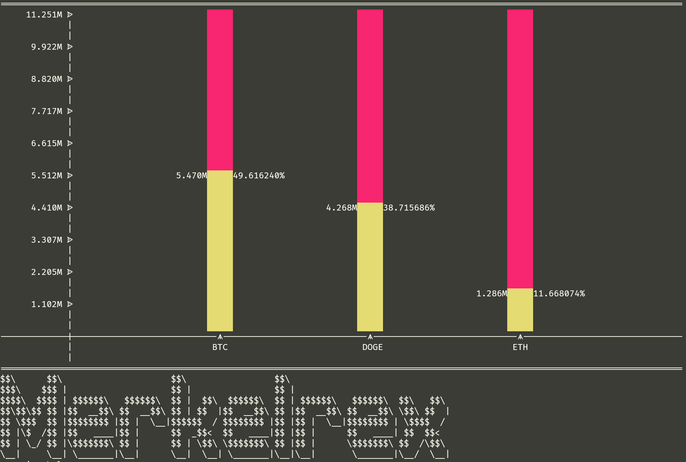

# Merkelrex: C++ Limit-Order Matching Engine + Market Data Replay



Merkelrex is a C++17 limit-order matching engine with a replayable order flow, built on top of an earlier orderbook simulator. The core is price-time-priority matching with partial fills, order cancellation, fixed-point prices, book snapshots (best bid/ask, spread, mid, depth, imbalance), and text/JSON replay output. Around that core there are extras for exploring market data: Binance `bookTicker` support and terminal visualizations.

It started as my CM2005 Object Oriented Programming mid-term project (a small CSV exchange simulator). I kept building after the coursework because the matching problem interested me more than expected, and moved the data story onto real Binance public data (COIN-M futures `bookTicker`: historical best bid/ask price and quantity updates).

## Quickstart (no downloads needed)

```bash
cmake -S . -B build
cmake --build build
ctest --test-dir build --output-on-failure
./build/merkelrex replay
./build/merkelrex replay --json | head -c 600
```

`replay` reads the committed `sample_orders.csv`, submits/cancels orders through the matching engine, prints trades, and shows the final book state. `--json` emits the same run as machine-readable JSON for scripts. The older alias `match-demo` still works.

## Ways to run it

**Primary: matching-engine replay (backend core).**

```bash
./build/merkelrex replay
./build/merkelrex replay --json
./build/merkelrex replay path/to/orders.csv
```

**Extra: interactive menu (legacy visualization path).** Requires a Binance `bookTicker` zip in the project root (see Data section):

```bash
./build/merkelrex
```

From the menu you can inspect exchange stats, enter asks/bids, print the wallet, draw candlestick and volume/notional graphs, step timeframes, and auto-play market data. Without the data file it prints where to get it and points back to `replay`.

**Extra: fullscreen market terminal.** Also requires the Binance zip:

```bash
./build/merkelrex tui
```

This mode uses FTXUI to render the `bookTicker` replay as an in-place Exchange Floor dashboard (space pause/resume, `n` step, `f`/`s` speed, `r` reset cadence, `q` exit). Without the data file it exits with the download pointer instead of a blank screen.

## Screenshots

The original project put a lot of effort into terminal visualization. These charts are not the whole project, but they are still the most visible part of it.

Candlestick chart from historical ETH/BTC ask data:



Volume graph comparing BTC, DOGE, and ETH volume in USDT terms:



## Project Layout

```text
main.cpp                  Entry point, replay command routing, interactive/TUI modes
MatchingEngine.*          Limit-order matching engine (price-time priority, fills, cancel)
FixedPoint.*              8-decimal fixed-point value type used by the matching engine
Order.* / Trade.*         Matching-engine domain objects
sample_orders.csv         Committed replay file, works with zero downloads
tests/orderbook_tests.cpp Small no-dependency C++ test runner
CSVReader.*               CSV parsing and row validation, Binance bookTicker adapter
OrderBook.*               Historical market-data storage, filtering, matching, OHLCV logic
OrderBookEntry.*          Single historical bid/ask/trade row
MerkelMain.*              Legacy interactive menu workflow (needs Binance zip)
MerkelTui.*               Fullscreen FTXUI market terminal (needs Binance zip)
Wallet.*                  User balance tracking
Candlestick.* / Volume.*  OHLC and volume data models
Canvas.*                  Terminal drawing surface
CandlestickGraph.*        Terminal candlestick renderer
VolumeGraph.*             Terminal volume renderer
assets/                   README images and original design sketches
```

## Build

The project uses CMake and C++17. CI runs configure, build, tests, and a replay smoke test on every push/PR (`.github/workflows/ci.yml`).

```bash
cmake -S . -B build
cmake --build build
```

Run the matching-engine replay (no downloads needed):

```bash
./build/merkelrex replay
```

Run replay with JSON output:

```bash
./build/merkelrex replay --json
```

Pass a different order file:

```bash
./build/merkelrex replay path/to/orders.csv
```

Run the tests:

```bash
ctest --test-dir build --output-on-failure
```

Run the legacy interactive menu or fullscreen TUI (both need the Binance zip from the Data section):

```bash
./build/merkelrex
./build/merkelrex tui
```

## Data

The full historical data files are not committed to this repo because they are large. The interactive app currently expects this Binance file in the project root:

```text
ADAUSD_230929-bookTicker-2023-09-29.zip
```

Binance COIN-M futures `bookTicker` files can be downloaded from:

```text
https://data.binance.vision/?prefix=data/futures/cm/daily/bookTicker/
```

The Binance `bookTicker` CSV inside the zip has this shape:

```text
update_id,best_bid_price,best_bid_qty,best_ask_price,best_ask_qty,transaction_time,event_time
745418277880,0.24910000,123.00000000,0.24920000,8.00000000,1695945600934,1695945600949
```

Merkelrex adapts each Binance `bookTicker` row into two internal rows:

```text
event_time,product,bid,best_bid_price,best_bid_qty
event_time,product,ask,best_ask_price,best_ask_qty
```

That lets the original market-stats and charting code keep working while the underlying data comes from Binance. Event timestamps are converted from milliseconds to readable UTC strings.

For Binance `bookTicker`, option `7` graphs top-of-book notional at the current timestamp. That is not the same thing as traded volume; it is `best_bid_price * best_bid_qty` plus `best_ask_price * best_ask_qty`. The older coursework pair data still uses the original USDT volume conversion path.

Option `10` starts continuous market playback. It samples upcoming timestamp gaps, chooses a terminal-friendly delay automatically, then prints compact top-of-book snapshots until the process is stopped.

The older coursework CSV format is still supported:

```text
timestamp,product,side,price,amount
2020/06/01 11:57:30.328127,ETH/BTC,bid,0.02482205,23.9999428
```

The replay path uses the small committed `sample_orders.csv` file:

```text
symbol,side,price,quantity
ETH/USDT,sell,100.00,5
ETH/USDT,buy,100.50,3
```

It also supports cancellation rows:

```text
cancel,3
```

Cancellation only applies to orders that are still resting on the in-memory book. Fully filled orders and unknown ids are rejected.

## What I Added After The Original Coursework

- CMake build setup.
- A clean quit option in the original menu.
- Safer handling for missing or empty CSV data.
- CSV validation for malformed rows, unknown sides, and non-positive values.
- Binance COIN-M futures `bookTicker` zip support.
- Top-of-book notional graph fallback for one-symbol Binance data.
- Tests for parsing, time navigation, price aggregation, candlesticks, volume, matching, cancellation, and book stats.
- A newer `MatchingEngine` separate from the original menu code.
- Fixed-point values in the newer matching engine.
- Price-time-priority matching with partial fills.
- Order cancellation for resting orders.
- Book snapshots and simple live stats: best bid, best ask, spread, mid-price, depth, and imbalance.
- A replay command with text and JSON output.

## What Worked

- The custom `Canvas` class made terminal drawing much easier than trying to print everything directly in nested loops.
- Weighted average prices gave the candlestick open/close values more meaning than choosing an arbitrary row.
- Splitting out the newer `MatchingEngine` made it easier to test matching behavior without driving the whole menu app.
- Keeping the project mostly plain C++ made the data structures easy to see and reason about.

## What Is Still Rough

- The original historical-data path still uses `double`/`long double`; only the newer matching engine uses fixed-point integers.
- Binance support currently targets `bookTicker` only. Other Binance datasets like trades, klines, and bookDepth are not wired into the app yet.
- The newer matching engine is in-memory only.
- Cancellation is by order id only; there is no user/session ownership model.
- The CSV parser is deliberately small and does not try to handle every possible CSV edge case.
- There is no persistence layer, networking, or database.
- Some parts still show their coursework origin, especially the menu flow and older class boundaries.

I am keeping those limitations visible because they are true. This is not meant to pretend to be a production exchange. It is a coursework project that grew into a more complete C++ orderbook experiment.

## Next Things I Might Add

- A cleaner order-management CLI around submit/cancel/book/trades.
- Better chart aggregation for high-frequency Binance bookTicker data.
- Support for Binance klines after bookTicker is stable.
- JSON output for the historical market stats and candle path.
- More tests around edge cases in the matching engine.
- A small REST API, if I decide it is worth adding instead of keeping this as a terminal-first project.
- Terminal recordings of the chart output.

## Main Takeaway

The part I like about this project is that it turns a simple CSV-based coursework simulator into something I can keep improving piece by piece. The terminal charts came first, then safety fixes, then tests, then a cleaner matching engine. It is still small, but it has become a useful place for me to practise C++ design around market data and order matching.
